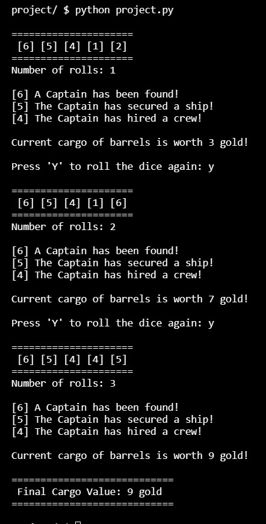

# The Captain, Ship and Crew (Dice Game)
#### Video Demo:  https://youtu.be/wbkj5yliGrY
#### Description: Single player version of the dice game, **"The Captain, Ship and Crew"**
#### Created by: Lee Williams - November 2023
I have implemented a single player version of the dice game, **"The Captain, Ship and Crew"**

- The player gets a maximum of three rolls with five dice.
- First you need to get a [6] **Captain**, a [5] **Ship**, and a [4] **Crew**, in that order.
- As the player throws each of these special numbers, those dice are removed from play.
- Once a player has gotten his Captain, Ship and crew, the score is the value shown on the remaining two dice which represents the ship's cargo.
- These last two dice must be rolled as a pair, if you roll a 5 and a 2 you must keep both or re-roll both.
- If the player fails to get his Captain, Ship and crew, the score is 0 for that round.

#### Thoughts behind my code.
I first implemented the dice using a dict to represent each dice, but later decided that a class would be better.
```
dice={"dice1":0, "dice2":0, "dice3":0, "dice4":0, "dice5":0}
```
Now I was using a class for the dice, I built it using dataclasses to keep it simple and implement 2 methods within the class. First method to roll the dice and the second method to lock the dice so it can't be re-rolled
```
@dataclass
class DiceFactory:
    name: str
    value: int
    save: bool = False

    def roll(self):
        self.value = randint(1,6)
```
After I decided to use a class for each dice as they can be represented as an object I addressed the best way to have five dice together rather than individual objects. I settled on using a list and implemented the `create_dice` function.
```
def create_dice():
    dice=[]
    for i in range(5):
        dice.append(DiceFactory(f"d{i+1}",0,False))
        dice[i].roll()
    return dice
```
The `create_dice` function generates the following.
```
[DiceFactory(name='d1', value=5, save=False), DiceFactory(name='d2', value=5, save=False), DiceFactory(name='d3', value=6, save=False), DiceFactory(name='d4', value=2, save=False), DiceFactory(name='d5', value=5, save=False)]
```
After the dice have been created I call the `roll_dice` function to set initial values to each of the dice.
```
def roll_dice(dice):
    for i in range(5):
        if dice[i].save == False:
            dice[i].roll()
    return dice
```
There is a another function called `get_dice` which gets the value of each dice and creates a string `d2p` to be returned to `main` for printing to the screen.
```
def get_dice(dice):
    d2p = ""
    for i in range(5):
        d2p += (f"[{dice[i].value}] ")
    return d2p
```
The function `check_dice` is where all the game logic resides for checking values of dice and locking dice if a Captain, Ship or Cargo have been found.

```
def check_dice(dice, score):
    current_roll = []
    current_roll.clear()
    for i in range(5):
        current_roll.append(dice[i].value)

    if 6 in current_roll:
        print(f"\n[6] A Captain has been found!")
        dice[0].value = 6
        dice[0].save = True

    if 6 in current_roll and 5 in current_roll:
        print(f"[5] The Captain has secured a ship!")
        dice[1].value = 5
        dice[1].save = True

    if 6 in current_roll and 5 in current_roll and 4 in current_roll:
        score = sum(current_roll)-15
        print("[4] The Captain has hired a crew!")
        if score == 12:
            print(f"\nCurrent cargo is worth {score}, that's the largest haul I've ever seen!")
        else:
            print(f"\nCurrent cargo of barrels is worth {score} gold!")
        dice[2].value = 4
        dice[2].save = True
    return dice, score
```
Here is what it looks like when running.



Finally to help with debugging whilst working on my code is used the module [icecream](https://github.com/gruns/icecream), but have removed that from the final code.
